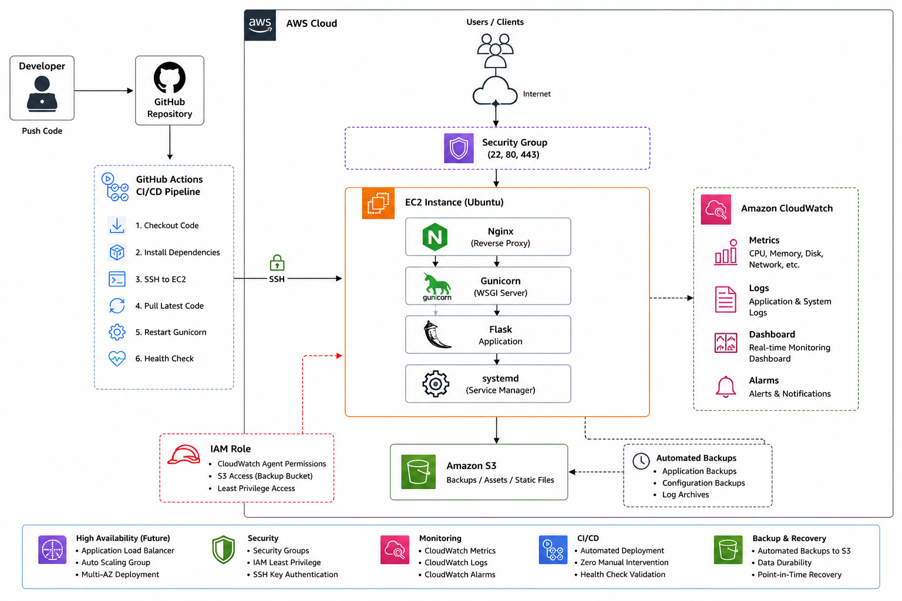

# 🚀 AWS DevOps Assignment – Production-Style Flask Deployment


---

# 📖 Project Overview

This project demonstrates a production-style deployment of a Flask web application on AWS using DevOps best practices.

The application is hosted on an Ubuntu EC2 instance behind Nginx and Gunicorn, automatically deployed using GitHub Actions, monitored with Amazon CloudWatch, secured using IAM Roles and Security Groups, and validated through load testing with k6.

---

# 🏗️ Architecture

The following diagram illustrates the complete deployment architecture of the project.

- **GitHub** hosts the source code.
- **GitHub Actions** automates the CI/CD pipeline.
- **Amazon EC2** hosts the application.
- **Nginx** acts as a reverse proxy.
- **Gunicorn** serves the Flask application.
- **Amazon CloudWatch** collects metrics, logs, and alarms.
- **Amazon S3** stores backups and static assets.
- **IAM Role** provides secure, least-privilege access to AWS services.

<p align="center">
  
</p>

---

### Request Flow

```text
User
   │
   ▼
Nginx (Port 80)
   │
   ▼
Gunicorn (127.0.0.1:8000)
   │
   ▼
Flask Application
```

### Deployment Flow

```text
Developer
      │
      ▼
GitHub Repository
      │
      ▼
GitHub Actions
      │
      ▼
EC2 Instance
      │
      ▼
Git Pull
      │
      ▼
Install Dependencies
      │
      ▼
Restart Gunicorn
      │
      ▼
Health Check
```

---
# ✨ Features

* Production-ready Flask deployment
* Nginx reverse proxy
* Gunicorn application server
* systemd service management
* GitHub Actions CI/CD
* Amazon CloudWatch monitoring
* CloudWatch dashboards and alarms
* Amazon S3 integration
* IAM Role with least privilege
* Automated deployments
* k6 performance testing
* AWS Free Tier compatible

---

# ☁️ AWS Services Used

| Service         | Purpose                  |
| --------------- | ------------------------ |
| EC2             | Application Hosting      |
| IAM             | Secure Access Management |
| S3              | Backups / Static Assets  |
| CloudWatch      | Monitoring & Logging     |
| Security Groups | Firewall Rules           |

---

# 🛠 Technology Stack

* Python 3.12
* Flask
* Gunicorn
* Nginx
* Ubuntu Server
* Git
* GitHub Actions
* AWS CLI
* Amazon CloudWatch
* Amazon S3
* k6

---

# 📂 Project Structure

```text
aws-devops-assignment/
│
├── app/
├── docs/
├── monitoring/
├── nginx/
├── systemd/
├── load-test/
├── screenshots/
├── .github/
│   └── workflows/
├── README.md
└── requirements.txt
```

---

# 🚀 Deployment Workflow

Developer

↓

GitHub Repository

↓

GitHub Actions

↓

EC2 Instance

↓

Git Pull

↓

Install Dependencies

↓

Restart Gunicorn

↓

Health Check

---

# 📊 Monitoring

Amazon CloudWatch is configured to collect:

* CPU Utilization
* Memory Usage
* Disk Usage
* Network Metrics
* Nginx Logs
* System Logs

CloudWatch Dashboard provides real-time visualization.

CloudWatch Alarms notify when configured thresholds are exceeded.

---

# ⚡ Load Testing

Tool Used:

* k6

## Basic Load Test

* Virtual Users: 20
* Duration: 30 seconds
* Total Requests: 600
* Average Response Time: 2.03 ms
* Error Rate: 0%

## Stress Test

* Peak Users: 100
* Total Requests: 232,364
* Average Response Time: 23.07 ms
* Maximum Response Time: 385.40 ms
* Throughput: 1,936 requests/sec
* Error Rate: 0%

---

# 🔒 Security

* IAM Role (Least Privilege)
* Security Groups
* SSH Key Authentication
* Nginx Reverse Proxy
* Gunicorn bound to localhost
* GitHub Secrets
* CloudWatch Logging

---

# 📸 Screenshots

Include the following screenshots:

* EC2 Instance
* Flask Application
* GitHub Actions Success
* CloudWatch Dashboard
* CloudWatch Logs
* CloudWatch Alarms
* S3 Bucket
* Load Test Results
* Architecture Diagram

---

# 📚 Documentation

Detailed documentation is available in the `docs/` directory.

* Deployment Guide
* Security Summary
* Architecture Documentation
* Performance Analysis
* Final Report

---

# 🔮 Future Improvements

* HTTPS using Let's Encrypt
* Application Load Balancer
* Auto Scaling Group
* Amazon RDS
* Docker Deployment
* Kubernetes Deployment
* Terraform Infrastructure as Code
* Ansible Configuration Management

---

# 👨‍💻 Author

**Alok Pandey**

GitHub: https://github.com/aalok-akarsh

LinkedIn: www.linkedin.com/in/alokpadey3663

---

# 📄 License

This project was developed as part of a DevOps technical assignment for learning and demonstration purposes.
